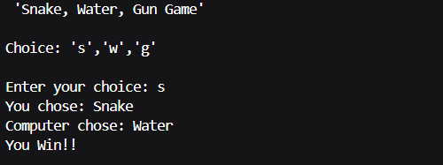

# Snake-Water-Gun-Game

## About
The **Snake-Water-Gun Game** is a simple Python-based command-line game inspired by the classic "Rock, Paper, Scissors" game. In this game, the player competes against the computer by selecting one of three options: **Snake, Water, or Gun**. It was fun to make this game and bring this classic idea to life!

## Rules
- **Snake vs. Water** → **Snake wins** (Snake drinks the water)
- **Water vs. Gun** → **Water wins** (Water rusts the gun)
- **Gun vs. Snake** → **Gun wins** (Gun shoots the snake)
- If both the player and the computer choose the same option, it's a **draw**.

## How to Play
1. Run the Python script.
2. Enter your choice:
   - **'s'** for **Snake**
   - **'w'** for **Water**
   - **'g'** for **Gun**
3. The computer will randomly select one of the three choices.
4. The result will be displayed (Win/Loss/Draw).

## Installation & Running the Game
### Prerequisites
- Python 3.x installed on your system.

### Steps to Run
1. Clone this repository:
   ```sh
   git clone https://github.com/your-username/Snake-Water-Gun-Game.git
   ```
2. Navigate to the project folder:
   ```sh
   cd Snake-Water-Gun-Game
   ```
3. Run the Python script:
   ```sh
   python main.py
   ```

## Example Gameplay
```
 'Snake, Water, Gun Game' 

Choice: 's' for Snake, 'w' for Water, 'g' for Gun

Enter your choice: s
You chose: Snake
Computer chose: Gun
You Lose!!
```

## Output Screenshot


## Contributing
Feel free to contribute by improving the game logic, adding a graphical interface, or enhancing the user experience. Open a pull request with your changes!

## License
This project is licensed under the MIT License.

